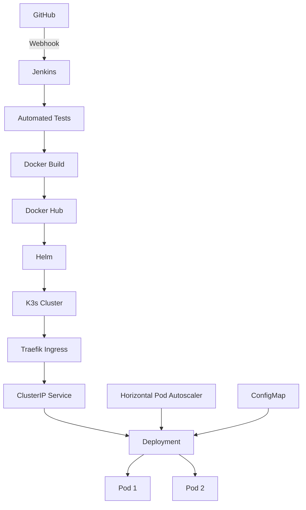

# Kubernetes Production Lab

A hands-on Kubernetes lab demonstrating production-style application deployment, Helm packaging, health checks, autoscaling, ingress routing, rolling updates and CI/CD integration.

The lab runs on a real single-node K3s cluster hosted on a cloud server.

The main application deployed in this environment is:

[HarunSert/devops-lab-api](https://github.com/HarunSert/devops-lab-api)

## Architecture



## Technologies

- Kubernetes / K3s
- Docker
- Helm
- Jenkins
- GitHub Webhooks
- Docker Hub
- Traefik Ingress
- Metrics Server
- Horizontal Pod Autoscaler
- ConfigMap
- Kubernetes Secrets
- Resource Requests and Limits
- Liveness and Readiness Probes
- Rolling Update Strategy
- Git

## Main Application

The primary application deployed in this lab is:

```text
devops-lab-api
```

Application repository:

[HarunSert/devops-lab-api](https://github.com/HarunSert/devops-lab-api)

Current tested release:

```text
Application Version : 1.0.2
Docker Image        : harunsert/devops-lab-api:1.0.2
Helm Revision       : 2
Namespace           : devops-lab
Replica Count       : 2
HPA Range           : 2-5
CPU Target          : 50%
```

## CI/CD Integration

The Kubernetes deployment is integrated with the Jenkins pipeline in the `devops-lab-api` repository.

```text
Git Tag
   |
   v
GitHub Webhook
   |
   v
Jenkins
   |
   +--> Automated Tests
   |
   +--> Docker Build
   |
   +--> Docker Hub Push
   |
   +--> Clone Deployment Repository
   |
   +--> Helm Upgrade
   |
   +--> Kubernetes Rolling Deployment
   |
   v
Deployment Verification
```

Example release:

```bash
git tag 1.0.2
git push origin 1.0.2
```

The same release version is used across the deployment:

```text
Git Tag      : 1.0.2
Docker Image : harunsert/devops-lab-api:1.0.2
APP_VERSION  : 1.0.2
```

## Helm Deployment

The Helm chart for the API is located at:

```text
helm/devops-lab-api/
```

Example deployment:

```bash
helm upgrade \
  --install devops-lab-api \
  helm/devops-lab-api \
  --namespace devops-lab \
  --set image.repository=harunsert/devops-lab-api \
  --set-string image.tag=1.0.2 \
  --set-string config.APP_VERSION=1.0.2 \
  --atomic \
  --timeout 3m
```

The `--atomic` option ensures that a failed Helm operation does not leave the release in a partially deployed state.

## Kubernetes Resources

The API deployment uses the following Kubernetes resources:

```text
Traefik Ingress
       |
       v
ClusterIP Service
       |
       v
Deployment
       |
       +--> Pod 1
       |
       +--> Pod 2
```

Additional components:

```text
ConfigMap
HorizontalPodAutoscaler
Resource Requests / Limits
Readiness Probe
Liveness Probe
Rolling Update Strategy
```

## Application Health Checks

The application exposes dedicated health endpoints.

Readiness:

```text
/health/ready
```

Liveness:

```text
/health/live
```

Example readiness test:

```bash
curl \
  -H "Host: api.devops-lab.local" \
  http://127.0.0.1/health/ready
```

Expected response:

```json
{
  "status": "ready"
}
```

Kubernetes uses these endpoints to determine whether the container is alive and whether it is ready to receive traffic.

## Ingress

Traefik is used as the Kubernetes Ingress Controller.

Application host:

```text
api.devops-lab.local
```

Test:

```bash
curl \
  -H "Host: api.devops-lab.local" \
  http://127.0.0.1/
```

Example response:

```json
{
  "application": "devops-lab-api",
  "environment": "lab",
  "version": "1.0.2",
  "status": "running",
  "message": "DevOps CI/CD pipeline is running"
}
```

Traffic flow:

```text
Client
   |
   v
Traefik
   |
   v
Ingress
   |
   v
Service
   |
   v
Pods
```

## Rolling Deployment

The API deployment uses a Kubernetes RollingUpdate strategy.

A real upgrade from version `1.0.1` to `1.0.2` was tested.

During the upgrade Kubernetes created a new ReplicaSet and replaced the previous Pods after the new Pods became ready.

Example result:

```text
Old ReplicaSet:
devops-lab-api-64d495d548   0 replicas

New ReplicaSet:
devops-lab-api-7b46f6b98    2 replicas
```

Deployment status can be monitored with:

```bash
kubectl rollout status \
  deployment/devops-lab-api \
  -n devops-lab
```

The deployed image can be verified with:

```bash
kubectl get deployment devops-lab-api \
  -n devops-lab \
  -o jsonpath='{.spec.template.spec.containers[0].image}{"\n"}'
```

Example result:

```text
harunsert/devops-lab-api:1.0.2
```

## Horizontal Pod Autoscaler

The API deployment has HPA configured with:

```text
Minimum replicas : 2
Maximum replicas : 5
CPU target       : 50%
```

Check HPA:

```bash
kubectl get hpa -n devops-lab
```

The API also provides a CPU load endpoint:

```text
/load?seconds=N
```

which can be used for autoscaling tests.

## Helm Release History

Check the release history:

```bash
helm history devops-lab-api -n devops-lab
```

The tested release lifecycle currently includes:

```text
Revision 1 -> Initial Helm installation with version 1.0.1
Revision 2 -> Automated Helm upgrade to version 1.0.2
```

## Earlier Nginx Kubernetes Lab

Before integrating the FastAPI application, an Nginx-based Kubernetes lab was used to test core Kubernetes concepts.

The Nginx lab includes:

- Namespace isolation
- Multi-replica Deployment
- ClusterIP Service
- ConfigMap
- Kubernetes Secret
- Resource requests and limits
- Liveness and readiness probes
- Traefik Ingress
- Horizontal Pod Autoscaler
- Rolling updates
- Kubernetes rollback
- Helm install
- Helm upgrade
- Helm rollback

During HPA testing, the Nginx deployment successfully scaled from:

```text
2 Pods -> 5 Pods
```

based on CPU utilization.

The Nginx Helm release lifecycle was also tested:

```text
Revision 1 -> Initial installation
Revision 2 -> Helm upgrade
Revision 3 -> Helm rollback
```

## Repository Structure

```text
.
├── helm/
│   ├── devops-lab-api/
│   │   ├── Chart.yaml
│   │   ├── values.yaml
│   │   └── templates/
│   │       ├── configmap.yaml
│   │       ├── deployment.yaml
│   │       ├── hpa.yaml
│   │       ├── ingress.yaml
│   │       └── service.yaml
│   │
│   └── nginx-demo/
│       ├── Chart.yaml
│       ├── values.yaml
│       └── templates/
│
├── kubernetes/
│   ├── namespace.yaml
│   ├── configmap.yaml
│   ├── deployment.yaml
│   ├── service.yaml
│   ├── ingress.yaml
│   └── hpa.yaml
│
├── scripts/
│   ├── load-test.sh
│   └── stop-load-test.sh
│
├── .gitignore
└── README.md
```

## Concepts Demonstrated

This lab demonstrates practical implementation of:

- Kubernetes application deployment
- Helm package management
- CI/CD based application delivery
- Semantic release versioning
- Rolling application upgrades
- Application health checks
- Resource management
- Horizontal autoscaling
- Service discovery
- Ingress routing
- Configuration management
- Secret handling
- Deployment verification

## Lab Scope

This repository is a personal hands-on DevOps lab.

It demonstrates production-style Kubernetes concepts in a controlled environment and is not intended to represent a complete enterprise production platform.

The current K3s environment is a single-node cluster. Multiple application replicas provide application-level redundancy but not Kubernetes node-level high availability.

## Future Improvements

Possible future improvements include:

- Prometheus and Grafana
- Argo CD / GitOps
- Network Policies
- TLS Ingress
- Persistent Volumes
- Multi-node Kubernetes cluster
- Separate Jenkins build agents

## Related Repository

Application source code and Jenkins CI/CD pipeline:

[HarunSert/devops-lab-api](https://github.com/HarunSert/devops-lab-api)

## Author

**Harun Sert**

- GitHub: [HarunSert](https://github.com/HarunSert)
- LinkedIn: [Harun Sert](https://www.linkedin.com/in/harun-sert-819236233/)

